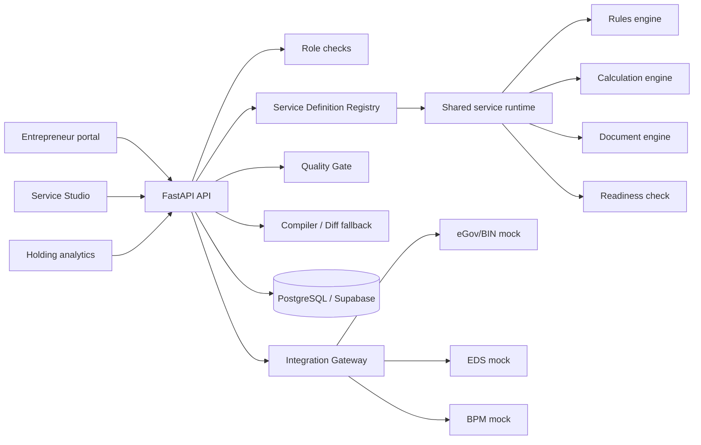

# Architecture

## Service definition lifecycle

An analyst edits a validated Pydantic definition. Quality Gate checks step/field/document references, calculations and impossible required fields. On publication, the previous version is archived and the new JSON definition becomes current. Entrepreneur requests resolve the current published version and the frontend renders its steps and fields; no service-specific form exists.

Rules use a closed operator/action vocabulary and never execute code or `eval`. Calculations use constrained operations with explicit inputs. Backend schemas are the source of truth; TypeScript consumes the documented JSON contract.

## Persistence

SQLAlchemy models store users, organizations, memberships, service versions, Business Passports, applications, status events, integration events and audit logs. `platform_entities` provides typed persistence for remaining demo catalog entities while PostgreSQL migrations establish the schema. SQLite is the offline demo fallback.

## Reliability and security

Owner checks protect applications/passports, role dependencies protect Studio/admin endpoints, Pydantic validates definitions, file metadata is constrained, payloads in integration logs are sanitized, submissions are idempotent, and all providers have deterministic fallbacks. Production extensions: OIDC/JWT, RLS, object-storage scanning, rate limiting and distributed tracing.

